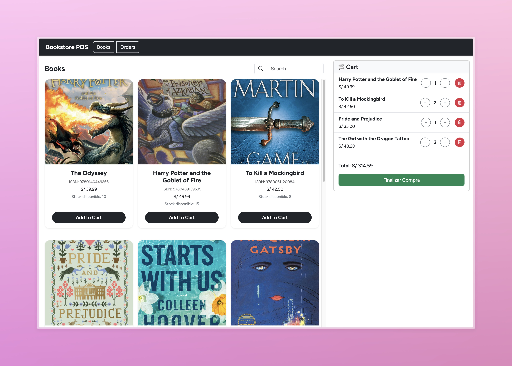
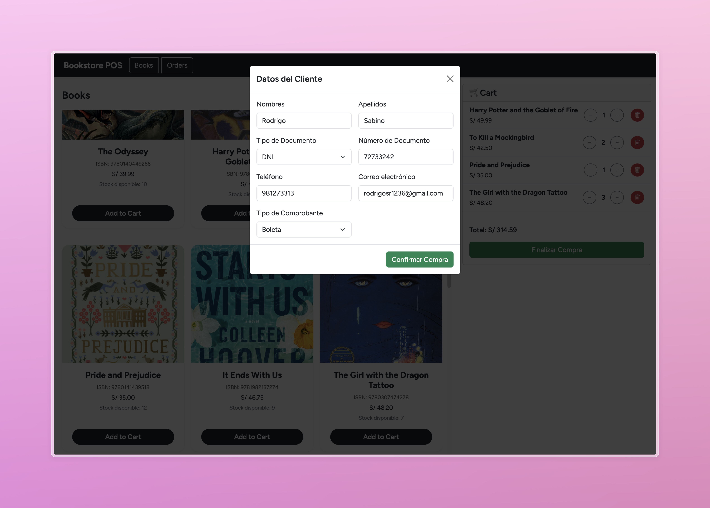
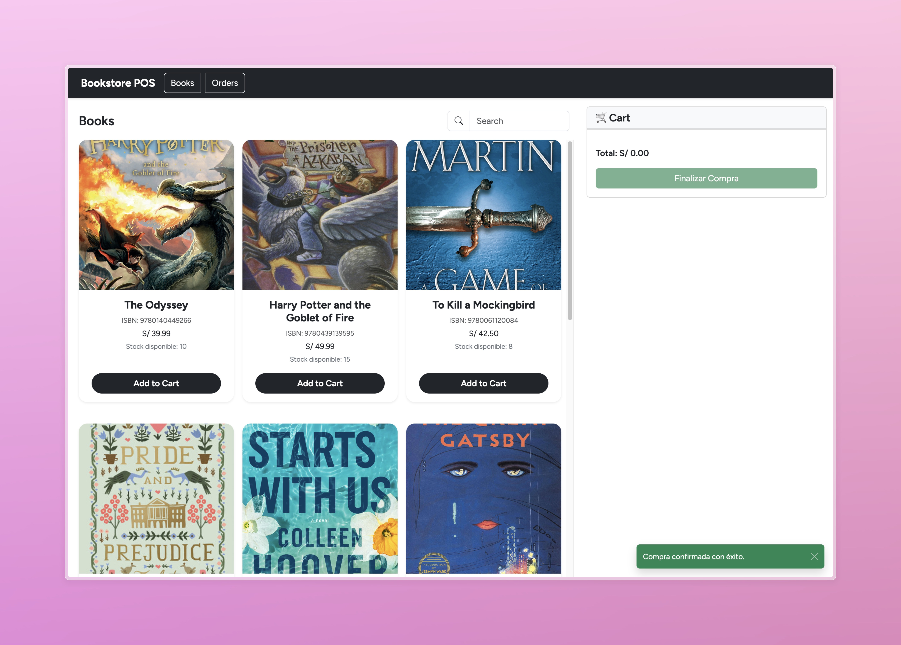
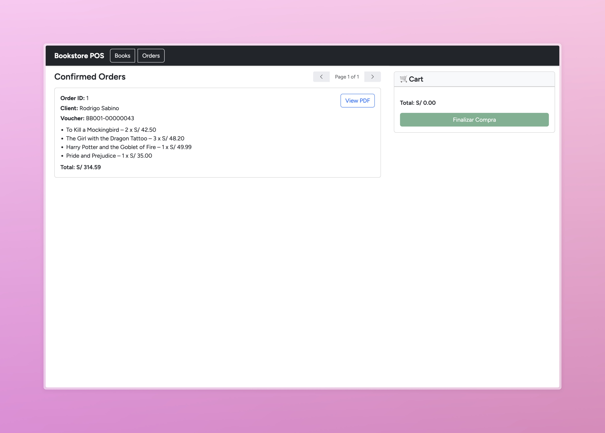
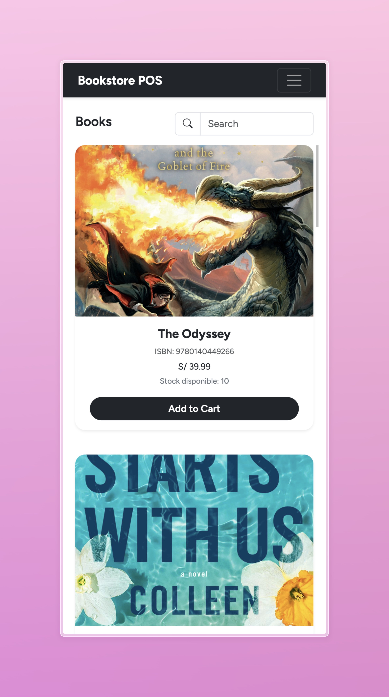
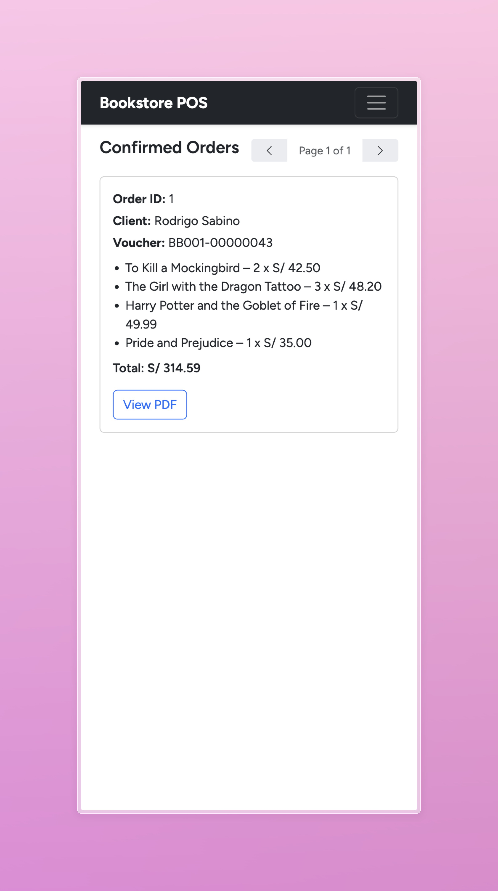

# 📚 Bookstore POS – Frontend

Frontend desarrollado con **Angular standalone components**, conectado a una API RESTful para gestionar libros, órdenes y procesos de checkout en una librería.

## 🚀 Características principales

- Visualización de libros con stock e imágenes
- Carrito de compras interactivo con validaciones de stock
- Checkout con validación de cliente y generación de orden
- Gestión de órdenes con paginación
- Interfaz responsive para escritorio y móvil
- Toasts de éxito y error para mejor experiencia de usuario

## 📦 Tecnologías utilizadas

- Angular 19
- Bootstrap 5
- RxJS
- TypeScript
- API Backend (Node.js + Express + Prisma)

## 📁 Estructura del proyecto

```
src/
├── app/
│   ├── core/                # Servicios y modelos globales
│   ├── features/            # Módulos funcionales (books, cart, orders, checkout)
│   ├── layout/              # Componentes de layout como navbar y main-layout
│   └── app.routes.ts        # Definición de rutas principales
```

## 🔧 Instalación

1. Clona el repositorio:

```bash
git clone https://github.com/bookstore-pos/frontend-bookstore.git
cd bookstore-frontend
```

2. Instala las dependencias:

```bash
npm install
```

3. Ejecuta el proyecto en modo desarrollo:

```bash
npm run dev
```

> La aplicación se ejecutará en: [http://localhost:4200](http://localhost:4200)

## 🔌 Configuración de entorno

Para que la app funcione correctamente, asegúrate de que la API backend esté corriendo en `http://localhost:3000`. Puedes cambiar esta URL desde el archivo:

```
src/environments/environment.ts
```

Ejemplo:

```ts
export const environment = {
  production: false,
  apiBaseUrl: 'http://localhost:3000/api'
};
```

## 📸 Screenshots

### 💻 Desktop View

Pantalla de Books

Modal de Recoleccion de datos del client

Toast de compra exitosa

Pantalla de Orders


### 📱 Mobile View

Pantalla de Books

Pantalla de Orders

